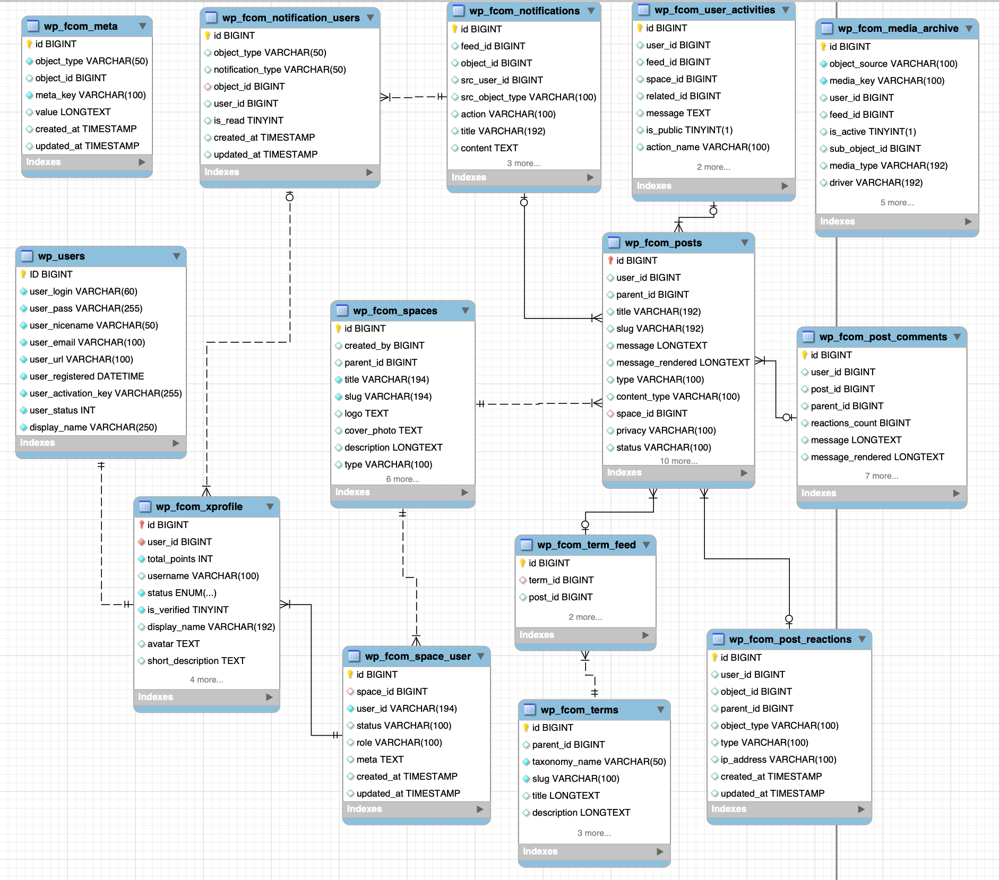

## Documentation Index

### Configure Clould Storage Service
Your community can get a lot of media files uploaded by users. It is a good idea to store these files in a cloud storage service like Amazon S3 or CloudFlare R2. This will help you to save your server space and bandwidth.
- [Configure CloudFlare R2 for Media Storage](configure-cloudflare-r2.md)
- [Configure Amazon S3 for Media Storage](configure-amazon-s3.md)
- [Configure BunnyCDN for Media Storage](configure-bunny_cdn.md)
- [Theme Compatibility Guide](theme-compatibility.md)

### Hooks
- [Action Hooks](action-hooks.md)
- [Filter Hooks](filter-hooks.md)

### Useful CodeSnippets
- [Important Code Snippets](code-snippets.md)
- [Modify Portal URL Slug](code-snippets.md#portal_slug)
- [Add Custom CSS to Portal](code-snippets.md#custom_css)
- [Add a user to a space](code-snippets.md#add_user_to_space)
- [Remove a user from a space](code-snippets.md#remove_user_from_space)

### Database
- [Database Schema](database-schema.md)

### Recommended Server Configuration
- [Recommended Server Configuration for FluentCommunity](recommended-server-config.md)
